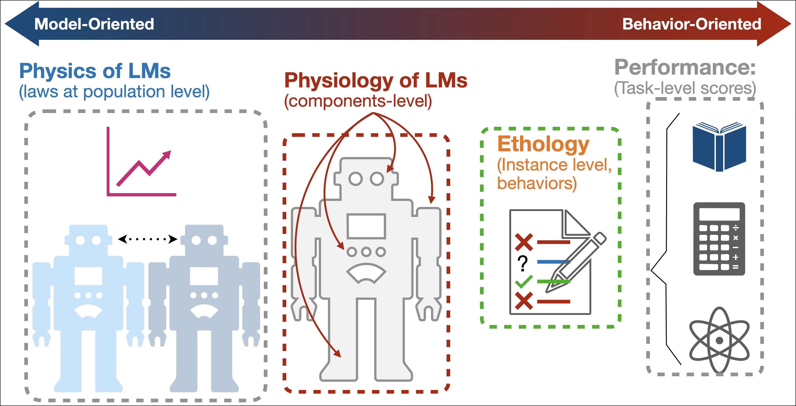

Welcome to the official page for our AAAI 2025 tutorial!

  

## Overview

- **Speakers:** [Chi Han](https://glaciohound.github.io), [Heng Ji](https://blender.cs.illinois.edu/hengji.html)
- **Venue:** [AAAI 2025 Tutorials](https://aaai.org/conference/aaai/aaai-25/tutorial-and-lab-list/#TQ15), session TQ15
- **Date and Time:** Wednesday, February 26, 2025, 2:00pm - 3:45pm
- **Location:** [Pennsylvania Convention Center](https://www.paconvention.com), Room 113A, Philadelphia, PA, U.S.A.

 

## Schedule

### Part 1: Ethology – How Do LMs Behave?
- **Syntax:** Do LMs care about syntax?
- **Knowledge:** Where is knowledge stored?
- **Reasoning:** How is reasoning conducted?

### Part 2: Physiology – What Roles Do Components Play?
- **Attention:** Position representation & imitation learning
- **Embeddings:** What is the function of word embeddings?

### Part 3: Physics – Rules and Laws of LMs
- **Scaling:** How performance scales
- **Impossibilites:** What LMs cannot do fundamentally

 

---

## Outline: Introducing A Emerging Science of Language Models

As large language models (LMs) continue to transform natural language processing and AI applications, they have become the backbone of AI-driven systems, consuming substantial economic and research resources while taking on roles that significantly influence society. The efficient, guaranteed, and reliable development of future language models demands the establishment of scientific analysis frameworks for language models. While extensive engineering insights and empirical observations have been accumulated, the immense resource costs of model development make blind explorations unsustainable. This necessitates scientific perspectives, guiding principles, and theoretical frameworks for studying language models. Though a systematic foundation for this emergent protoscience is yet to be fully constructed, preliminary studies already illuminate innovative adaptations of language models. This tutorial covers groundbreaking advancements and emerging insights in this new science. It aims to provide LM developers with guidelines for model development, provide interdisciplinary researchers with tools for creative application across domains, offer LM users predictive laws and guarantees of model behavior, and present the public with a deeper understanding of LMs.

The tutorial starts with the motivations for establishing a systematic science of language models (LMs), highlighting the need for guiding principles to overcome the rising costs and limitations of empirical approaches. Participants will explore the key challenges this field seeks to address, including predicting model behavior, interpreting internal mechanisms, optimizing training processes, and resolving issues like scaling inefficiencies and representation limitations. By integrating foundational components of this emerging discipline, the tutorial examines internal LM mechanisms, scaling behaviors, and theoretical frameworks, offers insights into the physiology of LM representations, and showcases how internal components process information alongside groundbreaking innovations. This comprehensive overview bridges practical applications with a deeper theoretical foundation, ultimately aiming to improve model transparency and reliability.

**Prerequisites:**
While a basic understanding of NLP and LM concepts (e.g., tokenization, embeddings, attention-mechanism, LM architectures) and a general AI research background are beneficial, this tutorial is designed to be accessible to all. We will provide high-level explanations to ensure that all participants, regardless of their expertise level, can engage and learn from this session.

 

---

## Speakers

### **Chi Han**

**Homepage:** [https://glaciohound.github.io](https://glaciohound.github.io)

**Google Scholar:** [https://scholar.google.com/citations?user=DcSvbuAAAAAJ&hl=en](https://scholar.google.com/citations?user=DcSvbuAAAAAJ&hl=en)

**Github:** [https://github.com/glaciohound](https://github.com/glaciohound)

Chi Han is a Ph.D. candidate in computer science at UIUC, advised by Prof. Heng Ji. His research focuses on understanding and adapting large language model (LLM) representations. He has first-authored papers in NeurIPS, ICLR, NAACL, and ACL, earning Outstanding Paper Awards for first-authored papers at NAACL 2024 and ACL 2024. He also received IBM Ph.D. Fellowship and Amazon Ph.D. Fellowship.

### **Heng Ji**

**Homepage:** [https://blender.cs.illinois.edu/hengji.html](https://blender.cs.illinois.edu/hengji.html)

**Google Scholar:** [https://scholar.google.com/citations?user=z7GCqT4AAAAJ&hl=en](https://scholar.google.com/citations?user=z7GCqT4AAAAJ&hl=en)

Heng Ji, a Professor at UIUC and Amazon Scholar, directs the Amazon-Illinois Center on AI for Interactive Conversational Experiences. With expertise in NLP, multimedia multilingual information extraction, and knowledge-enhanced language models, she has earned numerous accolades, including IEEE’s “AI’s 10 to Watch,” NSF CAREER, and multiple Best Paper Awards.

 

---

## Slides for the Tutorial

[**PDF version** (recommended)](assets/slides.pdf)

[**PPTX version**](https://github.com/Glaciohound/Science-of-LLMs-Tutorial/raw/refs/heads/main/assets/slides.pptx)

[**Keynote version**](https://github.com/Glaciohound/Science-of-LLMs-Tutorial/raw/refs/heads/main/assets/slides.key)
